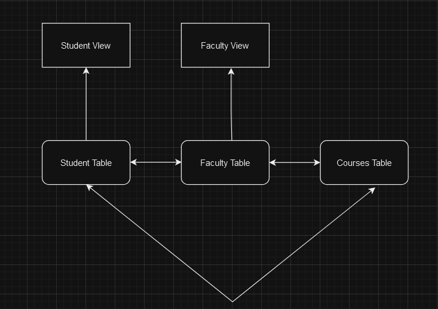
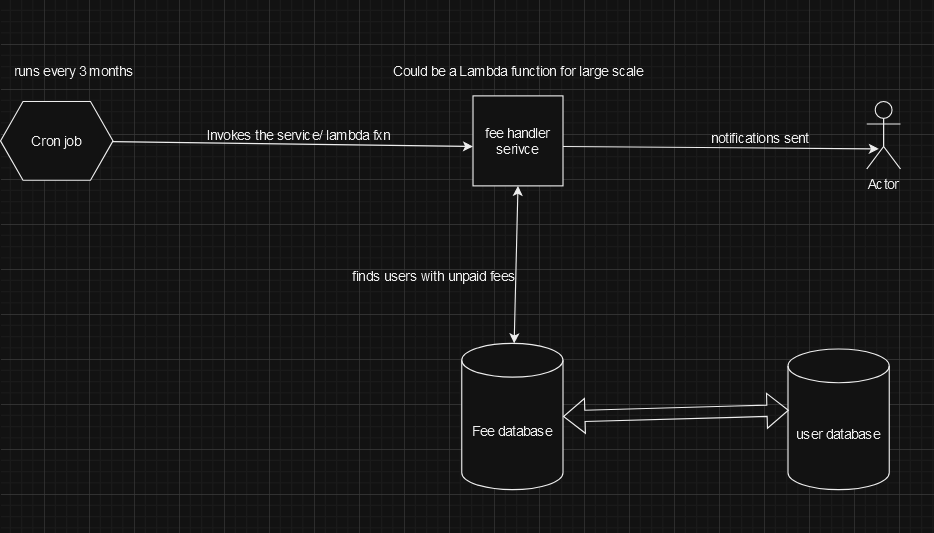

# SCHOOL ERP SYSTEM DESIGN
This readme contains a system design for a typical ERP system for a school/college. The design could be used to implement the **Web App** or **Mobile App**.
**Note:** This design doc includes some of the approaches and parts of an ERP system and not all the parts.

## Features and Views

#### The system will have these views:
- Student View
- Faculty View
- Admin View

#### Initially we can provide these features and increase them gradually:
- Information management
- Attendance management
- Fees management

## Design

#### Models:
Student model

>student
> - name
> - rollNumber
> - course
> - class
> - subjects: []

Faculty model

>faculty
> - name
> - id
> - classes: []
> - designation
> - subjects

Course model
>course
> - name
> - credits
> - startDate
> - endDate
> - totalStudentsEnrolled

We could implement more models, try to implement models such that they can have better relationships with each others.

####  Views:
We can start with the following views and add views later on

1. Student View
	
	- Student can view their timetable, courses they are enrolled in, and their fee status.
	- Students can view their attendance status.
	- Students can view their course materials and grades.

2. Faculty View
	
	- Faculties can view all the classes they are currently teaching.
	- Faculties can view and edit **student** info such as their **attendance** and course data.
	- Faculties can see their timetables.
	- Faculties can set student grades etc.

## Diagrams:

## Let's say we want to design a feature that will notify all the students of the fee payment every three months, this is how we can approach this:

### We can design more features similarly